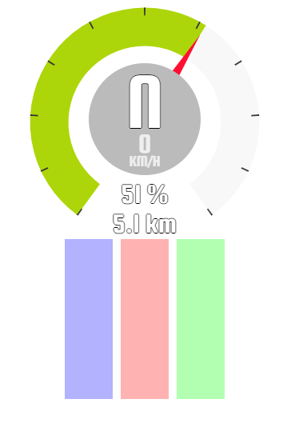

# DRTelemetry

Shows telemetry data from DiRT Rally in a Browser...



## Usage

1. Download DRTelemetry from the releases tab

2. Edit your `C:\Users\USER\Documents\My Games\DiRT Rally\hardwaresettings\hardware_settings_config.xml` and enable UDP data:

    ```xml
    <motion_platform>
            <dbox enabled="true" />
            <udp enabled="true" extradata="3" ip="127.0.0.1" port="10001" delay="1" />
            <fanatec enabled="true" pedalVibrationScale="1.0" wheelVibrationScale="1.0" ledTrueForGearsFalseForSpeed="true" />
    </motion_platform>
    ```

3. 
	
    On Windows run `drtelemetry.exe`
    
    On Linux run `./drtelemetry` in a terminal
    
4. Start DiRT Rally
5. Point your browser to `http://localhost:8080`
    
## Advanced usage

### Change listening ports

You can change the ports on which DRTelemetry is listening for connections. This helps in scenarios where you either want to show the UI on a different computer or run DRTelemetry on a different computer than DiRT Rally.

Run DRTelemetry from a terminal and add the following parameters.

| Parameter | Description                                  | Default         |
|-----------|----------------------------------------------|-----------------|
| http      | Host for Webclients                          |  localhost:8080 |
| udp       | Host for telemetry data sent from DiRT Rally | localhost:10001 |

**Example**

``
drtelemetry.exe --http 0.0.0.0:8080
``

### Change styling

You can change the styling by altering the CSS. This can be done with browser extensions like [Stylish](https://chrome.google.com/webstore/detail/stylish-custom-themes-for/fjnbnpbmkenffdnngjfgmeleoegfcffe).

## Contributing

Everyone can help to improve DRTelemetry. 

* suggest new features (open an issue)
* improve the README
* submit pull-requests
    